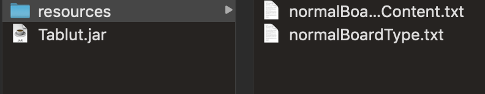

# Tablut
AI's course game competition.

## Usage
Create a folder in the same path of the jar called "resources".

Put then inside the two config files: "normalBoardType.txt" and "normalBoardContent.txt".

Execute finally with: java -jar Tablut.jar (Player [White|Black]) (Seconds)

Example: java -jar Tablut.jar White 60

Example: java -jar Tablut.jar Black 60

###Example of the resources folder

## N.B.
With the term "normal", we refer to the Tablut version presented in class.